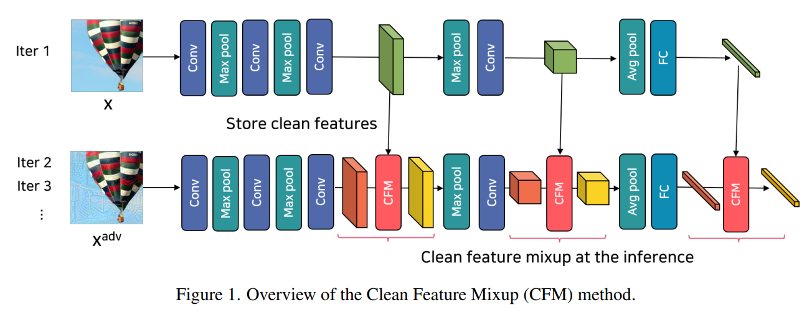
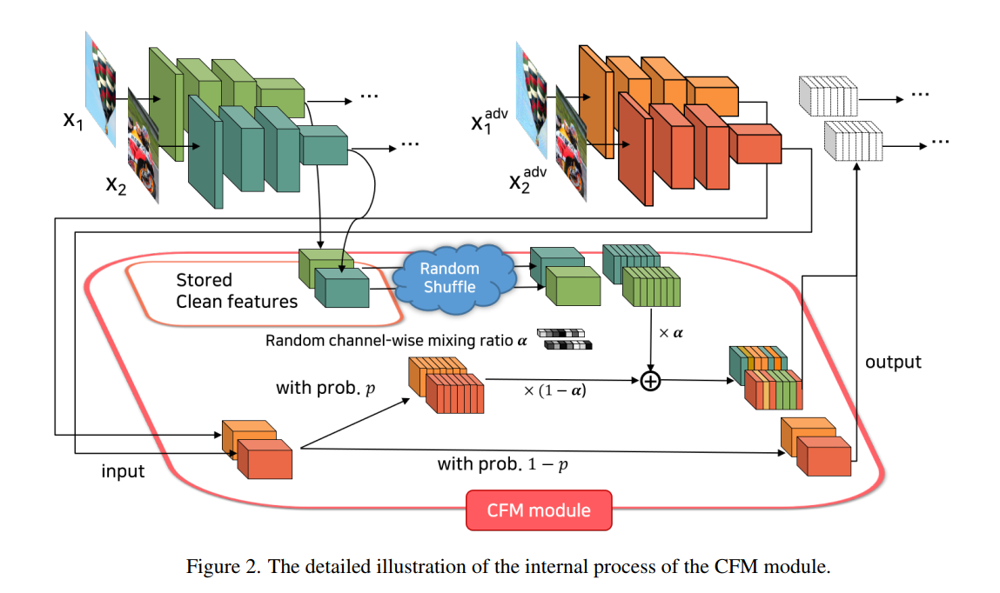
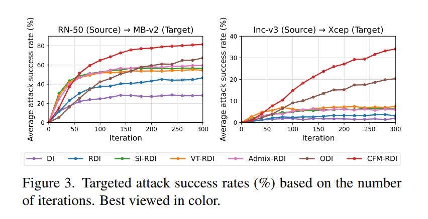

# Code for the Clean Feature Mixup (CFM) method

####  Official PyTorch implementation of the CVPR 2023 paper:
#### "Introducing Competition to Boost the Transferability of Targeted Adversarial Examples through Clean Feature Mixup"
##### *Junyoung Byun, Myung-Joon Kwon, Seungju Cho, Yoonji Kim, and Changick Kim*

[[Paper]](https://openaccess.thecvf.com/content/CVPR2023/papers/Byun_Introducing_Competition_To_Boost_the_Transferability_of_Targeted_Adversarial_Examples_CVPR_2023_paper.pdf) | [[arXiv]](https://arxiv.org/abs/2305.14846)


<center>







</center>


# Getting started

## Dependencies
We have saved the conda environment for Ubuntu.
You can install the conda environment by entering the following command at the conda prompt.

> conda env create -f cfm_env.yaml


## Models
Due to upload file size limitations, we cannot include all the weights of the used pretrained models.

### Pretrained models on the ImageNet dataset
The following models can be automatically downloaded.
> 'ResNet18', 'ResNet50','vgg16','inception_v3','efficientnet_b0', 'DenseNet121', 'mobilenet_v2','inception_resnet_v2','inception_v4_timm','xception','vit_base_patch16_224','levit_384','convit_base','twins_svt_base','pit'

Please download the weights for 'resnet50_l2_eps0_1' from <https://github.com/microsoft/robust-models-transfer> and move the checkpoint file to "./microsoft_robust_models_transfer/src/checkpoints/resnet50_l2_eps0.1.ckpt"

### Pretrained models on the CIFAR-10 dataset
Please download the pretrained weights for the following models from <https://github.com/huyvnphan/PyTorch_CIFAR10> and place the checkpoint files to "./PyTorch_CIFAR10/cifar10_models/state_dicts/"

> 'vgg16_bn', 'resnet18', 'resnet50','mobilenet_v2','inception_v3','densenet121'

## Datasets
Due to upload file size limitations, we cannot include all the test images of the ImageNet-Compatible dataset. Instead, we included 100 test images.

You can download full test images from the following link: [Dataset for nips17 adversarial competition](https://github.com/cleverhans-lab/cleverhans/tree/master/cleverhans_v3.1.0/examples/nips17_adversarial_competition/dataset)

Please place the images of the DEV set into './dataset/images'.

If you use full test images, please comment line 134 of 'eval_attacks.py' (-> # total_img_num=100).

## Usage

You can perform an attack experiment by entering the following command:

> python eval_attacks.py --config_idx=578

The 'eval_attacks.py' script receives config_idx as an execution argument, which designates the experiment configuration number.

The experiment configuration specifies the various parameters required for the experiment, such as epsilon, step size, various hyperparameters for CFM, etc. They are written in 'config.py'.

When an experiment is completed, the 'NEW_EXP_config_idx.xlsx' file is created in the results folder.
Using gen_table.py and gen_plot.py, you can print and visualize the attack success rates for comparison.


## BibTeX
```
@InProceedings{Byun_2023_CVPR,
    author    = {Byun, Junyoung and Kwon, Myung-Joon and Cho, Seungju and Kim, Yoonji and Kim, Changick},
    title     = {Introducing Competition To Boost the Transferability of Targeted Adversarial Examples Through Clean Feature Mixup},
    booktitle = {Proceedings of the IEEE/CVF Conference on Computer Vision and Pattern Recognition (CVPR)},
    month     = {June},
    year      = {2023},
    pages     = {24648-24657}
}
```


## Acknowledgement
We would like to express our gratitude to the authors of the following repositories for making their code available to the public and enabling us to build upon their work.

* https://github.com/zjysteven/DVERGE
* https://github.com/huyvnphan/PyTorch_CIFAR10
* https://github.com/MadryLab/robustness
* https://github.com/microsoft/robust-models-transfer

